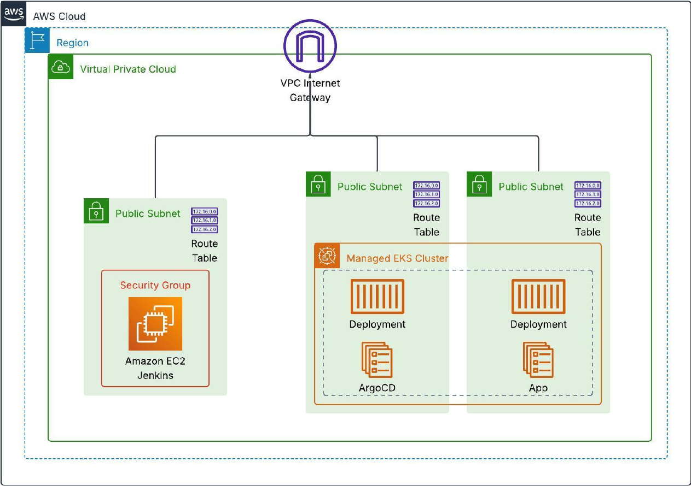
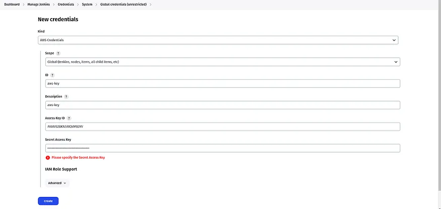
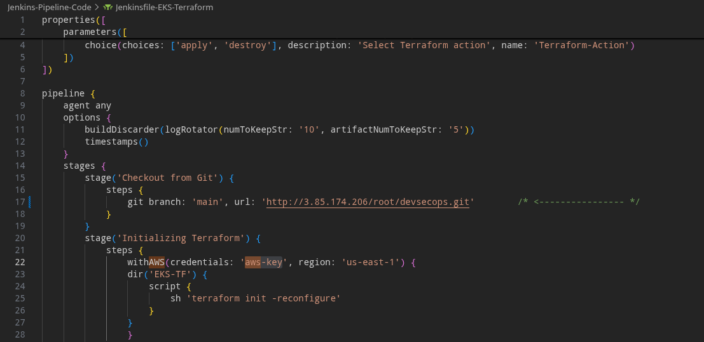
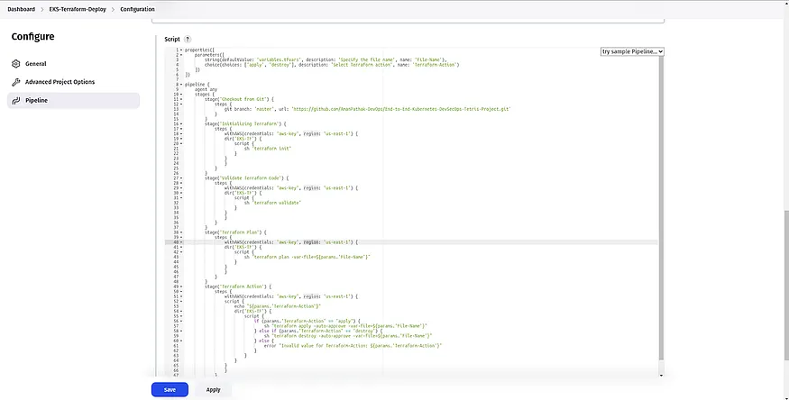
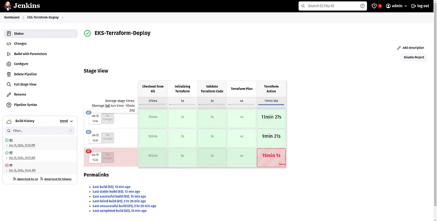

## Prerequisites

### Create SSH Key
- Create a SSH key named `user1`
  ```bash
  ssh-keygen -t rsa -b 4096 -f user1
  ```
 and save it in this path `~/.ssh/user1`

- Convert the private key to PEM format:

  ```bash
  openssl rsa -in user1 -outform PEM -out user1.pem
  ```

- You need to be sure you have:
  - `user1.pub`
  - `user1.pem`

- Start the SSH Agent

  ```bash
  eval "$(ssh-agent -s)"
  ```

- Add this key to your ssh:
  ```bash
  ssh-add ~/.ssh/user1.pem
  ```

- Make a copy to this repository
  ```bash
  cp ~/.ssh/user1.pem.pub ~/End-to-End-Kubernetes-DevSecOps-PoC/Jenkins-Server-TF/
  ```
## AWS Account

An AWS account and a IAM user with enough permission to perform the creation of:
- VPC
- Subnets  
- Access control list
- Internet Gateway
- NAT gateway
- Route tables
- Security groups
- EC2 instances
- EKS
- ELB

And you must to Create **Access key** whit those permitions too

# Terraform & AWS CLI Setup for Jenkins on AWS

We will install **Terraform** and **AWS CLI** to deploy our **Jenkins Server (EC2)** on **AWS Cloud**.

This document covers:

* Installing Terraform
* Installing AWS CLI
* Basic configuration for both tools

---

## Terraform Installation

Use the following commands to install Terraform on your local machine:

```bash
wget -O- https://apt.releases.hashicorp.com/gpg | sudo gpg - dearmor -o /usr/share/keyrings/hashicorp-archive-keyring.gpg

echo "deb [signed-by=/usr/share/keyrings/hashicorp-archive-keyring.gpg] https://apt.releases.hashicorp.com $(lsb_release -cs) main" | sudo tee /etc/apt/sources.list.d/hashicorp.list

sudo apt update

sudo apt install terraform -y
```

---

## AWS CLI Installation

Use the following commands to install AWS CLI v2:

```bash
curl "https://awscli.amazonaws.com/awscli-exe-linux-x86_64.zip" -o "awscliv2.zip"

sudo apt install unzip -y

unzip awscliv2.zip

sudo ./aws/install
```

---

## Configuration

### Configure Terraform

Edit the environment variables file and add your AWS credentials:

```bash
sudo vim /etc/environment
```

Add your AWS keys in the appropriate variables (access key and secret key).

After saving the file, **restart your machine** to apply the environment variable changes.

---

### Configure AWS CLI

Run the following command and provide your AWS credentials when prompted:

```bash
aws configure
```

You will be asked for:

* AWS Access Key ID
* AWS Secret Access Key
* Default region name
* Default output format

---

Once completed, Terraform and AWS CLI will be ready to deploy your Jenkins EC2 server on AWS.


# Files to change 

- ./End-to-End-Kubernetes-DevSecOps-PoC/Jenkins-Server-TF/backend.tf
- ./End-to-End-Kubernetes-DevSecOps-PoC/EKS-TF/backend.tf
- ./End-to-End-Kubernetes-DevSecOps-PoC/Jenkins-Pipeline-Code/Jenkinsfile-TetrisV1
- ./End-to-End-Kubernetes-DevSecOps-PoC/Jenkins-Pipeline-Code/Jenkinsfile-EKS-Terraform
- ./End-to-End-Kubernetes-DevSecOps-PoC/Manifest-file/deployment-service.yml

continue with the instruction before edit them but be aware that these are the files to modify

# Stage 1 Create the arquitecture



In this step, we will deploy a **Jenkins Server (EC2), Gitlab and Sonarqube** on **AWS Cloud** using **Terraform**.

---

## Clone the Git Repository

Clone the required repository to your local machine:

```bash
git clone https://github.com/sierraCode397/End-to-End-Kubernetes-DevSecOps-PoC.git
```

---

## Navigate to Terraform Configuration

Move into the Terraform directory for the Jenkins server:

```bash
cd End-to-End-Kubernetes-DevSecOps-PoC/Jenkins-Server-TF
```
---

## Update the Terraform Backend Configuration

Edit the `backend.tf` file and make the following changes:


> ⚠️ Make sure that both the S3 bucket is **already created manually** in AWS before proceeding.

```bash
  backend "s3" {
    bucket = "******"
    key    = "eks/terraform.tfstate"
    region = "us-east-1"
  }
```

---

## Initialize Terraform Backend

Initialize Terraform and configure the remote backend:

```bash
terraform init -reconfigure
```

---

## Validate and Format Terraform Code

Check for syntax errors:

```bash
terraform validate
```

Format the Terraform files:

```bash
terraform fmt
```

---

## Review the Execution Plan

Generate and review the Terraform execution plan to see which AWS resources will be created:

```bash
terraform plan -var-file=variables.tfvars
```

---

## Apply Terraform Configuration

Create the infrastructure on AWS Cloud:

```bash
terraform apply -var-file=variables.tfvars --auto-approve
```

⏱️ This process typically takes **3–4 minutes**.

---

## Connect to the Jenkins Server

1. Go to the **AWS EC2 Console**
2. Select the newly created Jenkins EC2 instance
3. Click on **Connect**
4. Copy the provided **SSH command**

Paste the SSH command into your local terminal to access the Jenkins server.

you must whrite something like this:

```bash
ssh -i "~/.ssh/user1.pem" ubuntu@3.85.174.206   
```
---

Once connected, your Jenkins server is ready for further configuration and pipeline setup.


# Stage 2 Gitlab

### Web Interface Access
In your browser, access both services using:
- Jenkins: `http://<public_ip-Jenkins-instance>:8880`
- GitLab: `http://<public_ip-Gitlab-instance>`

This will open the web interface for each service.

### SSH Access
Back in your terminal, connect to your instances using SSH. You'll need the public DNS of both instances:

### Retrieving GitLab Password

Once connected to the GitLab instance terminal, get the GitLab initial password by running:

```bash
sudo cat /srv/gitlab/config/initial_root_password
```

**Note**: This password is only available for 24 hours after installation.

## GitLab Initial Setup

### Login and Repository Creation
1. In your browser's GitLab interface:
   - Use the password obtained from the terminal
   - Set username as `root`
2. After logging in as root user:
   - Create a new repository
   - Make it **public**
   - **Do not** initialize with a README.md file
   - Save the project URL for future use

### API Token Creation
1. Go to project settings
2. Create a GitLab API token only for this repository (Not a personal token) with:
   - **Mantainer** role
   - Permissions: 
     - All API access
     - Read and write access
3. **Important**: Save the token secret for future steps

> **Note**: This lets you work with both public and private repositories and automatically detects any changes made by your coworkers. Just make sure everyone who needs access has been invited to the repo.

## Jenkins Integration Setup

### Project Settings Configuration
1. In project settings, go to "Integration" section
2. Find and select "Jenkins"
3. Configure connection:
   - Set a **connection name** (remember this for Jenkins job creation)
   - Allow the three triggers: Push, Tag and merge
   - Jenkins server URL: `http://<public_ip-Jenkins-instance>:8880`
   - Credentials:
     - Username: `admin`
     - Password: `This entry can't be empty so put a random text only, don't matter what`

### Important Notes:

- The test connection may fail initially (expected behavior) because you already don't have the jenkins job but it will work. Save the integration (Connection)

- The integration will work after Jenkins job creation

- Ensure connection name matches future Jenkins job name

- Save the integration/connection after configuration

## GitLab SSH Configuration

### Add SSH Key to GitLab Account
1. Go to your account settings in GitLab
2. Add your SSH public key:
   - On your local machine run:
     ```bash
     cat ~/.ssh/user1.pub
     ```
   - Copy the output and paste it in GitLab's SSH key section
3. Save the key

### Configure Git Repository Remote
1. In GitLab, go to your project
2. Get the SSH repository link (format will be similar to):
   ```bash
   ssh://git@Your_IP_OF_gitlab_instance:2424/Your_User_gitlab/your_repository_name.git
   ```
### Push to Repository

Remember add this key to your ssh:
  ```bash
  eval "$(ssh-agent -s)"
  ssh-add ~/.ssh/user1.pem
  ```

Init your repo:

```bash
git init --initial-branch=main
```

Set the remote URL in your local repository:

```bash
git remote add origin ssh://git@Your_IP_OF_gitlab_instance:2424/Your_User_gitlab/your_repository_name.git
```

And push your Repo:

```bash
git add .
git commit -m "Initial commit"                              
git push --set-upstream origin main
```
# Stage 3: Configure Jenkins

At this stage, we are logged into the **Jenkins Server (EC2)**.

---

## Installed Jenkins Plugins

The following plugins are already installed on the Jenkins server:

* Docker
* SonarQube
* Terraform
* kubectl
* AWS CLI
* Trivy
* Additional plugins required for better interaction

> ✅ Because these plugins are preinstalled, no additional setup is required for them at this stage.

---

## Access the Jenkins Web Interface

To access Jenkins:

1. Copy the **public IP address** of your Jenkins EC2 instance
2. Open your preferred web browser
3. Navigate to the following URL:

```
http://<JENKINS_PUBLIC_IP>:8880
```

---

## Deploying the EKS Cluster Using Jenkins

In this step, Jenkins will be used to deploy the **EKS cluster**.

Before proceeding, we must configure **AWS credentials** inside Jenkins.

---

## Configure AWS Credentials in Jenkins

Follow these steps to add AWS credentials:

1. Go to **Manage Jenkins**
2. Click on **Credentials**
3. Select **Add Credentials**
4. Set **Kind** to `AWS Credentials`
5. Enter the following details:

   * **ID**: Use the same ID as shown **aws-key** must be exactly
   * **Access Key ID**: Your AWS Access Key
   * **Secret Access Key**: Your AWS Secret Key
6. Click **Create**

Once completed, Jenkins will be able to authenticate with AWS and deploy resources such as the EKS cluster.



Now, Go to the Dashboard and click Create a job

1. Select the Pipeline and provide the name to your Jenkins Pipeline then click on OK.

2. Go to the GitHub Repository in which the Jenkins Pipeline code is located to deploy the EKS service using Terraform.

    - ./End-to-End-Kubernetes-DevSecOps-PoC/Jenkins-Pipeline-Code/Jenkinsfile-EKS-Terraform

3. Copy the entire code and paste it here

- **Note**: There will be some configurations like backend.tf files that need to be updated from your side. Kindly do that to avoid errors.




### After pasting the Jenkinsfile code, click on Save & Apply.




### Click on Build




### See the Pipeline as successful


Now, we will configure the EKS Cluster on the Jenkins Server